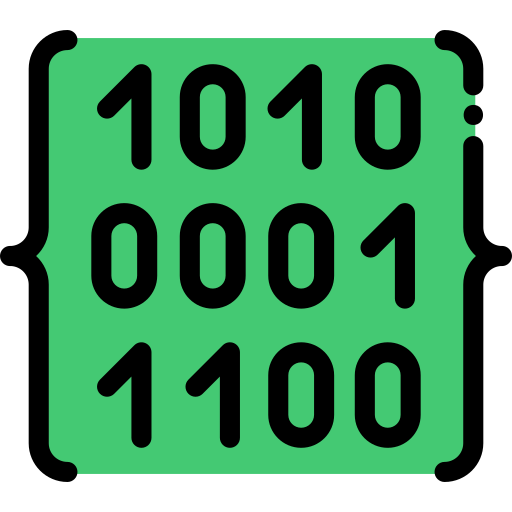

# bindata 

A python replication of the omonymous R library 
[`bindata`](https://cran.r-project.org/web/packages/bindata/bindata.pdf),
 based on the paper 
*"Generation of correlated artificial binary data."*, 
by Friedrich Leisch, Andreas Weingessel, and Kurt Hornik.

The library fully replicates the existing R-package 
with the following functions:
* `bincorr2commonprob`
* `check_commonprob` (`check.commonprob` in R)
* `commonprob2sigma`
* `condprob`
* `ra2ba`
* `rmvbin`
* `simul_commonprob` (`simul.commonprob` in R)

`SimulVals` is also available...

## How to

```python
from bindata import rmvbin
x = 3
```


For a more comprehensive documentation please consult 
the [documentation](https://cran.r-project.org/web/packages/bindata/bindata.pdf).

## Acknowledgements

* *"Generation of correlated artificial binary data."*, 
by Friedrich Leisch, Andreas Weingessel, and Kurt Hornik.

* <a href="https://www.flaticon.com/free-icons/code" title="code icons">Icon created by Freepik - Flaticon</a>

## Author

Luca Mingarelli, 2022


